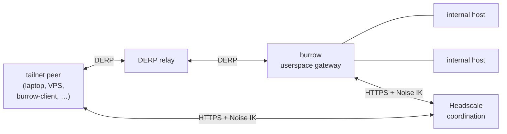

# burrow (headscale fork)

Userspace WireGuard gateway that joins a Tailscale-compatible tailnet
via Headscale + DERP. No TUN, no kernel drivers, no admin beyond raw
sockets for ICMP.

- [TL;DR](#tldr)
- [Quick start](#quick-start)
- [Examples](#examples)
- [Commands](#commands)
- [How it works](#how-it-works)
- [Library API](#library-api)
- [Limitations](#limitations)
- [Development](#development)
- [License](#license)

## TL;DR

`burrow` is a WireGuard peer you drop inside a private network. It
registers as a node on a Headscale tailnet, gets a `100.x.y.z` IPv4,
and exposes:

- transparent MASQUERADE for other tailnet peers reaching internal
  LAN hosts,
- SSH `-R`-style reverse tunnels bound on real OS listeners,
- a DNS resolver, and
- a remote shell,

all over a single CBOR control channel on `<tailnet_ip>:57821`.

Built on [boringtun](https://github.com/cloudflare/boringtun),
[smoltcp](https://github.com/smoltcp-rs/smoltcp), and the vendored
[tailscale-rs](https://github.com/tailscale/tailscale-rs) (DERP +
Noise IK + netmap).

Topology:



Coordination (who's who, what IP, which DERP region) is Headscale.
Transport (encrypted WG datagrams between peers) is DERP. There's no
direct P2P — Tailscale's disco / NAT-traversal magic is out of scope
here; everything relays.

Node identity is regenerated at every process start; nothing persists
to disk. Headscale's `ephemeral=true` registration means stale nodes
age out automatically.

## Quick start

You need a reachable Headscale server and a preauth key. If you don't
have one:

```sh
headscale users create test
headscale preauthkeys create --user test --reusable
# -> hskey-auth-<opaque-string>
```

Three deployment modes for `burrow`:

### 1. Ad-hoc CLI

```sh
cargo build --release
./target/release/burrow \
    --server-url https://headscale.example.com \
    --authkey hskey-auth-...
```

### 2. Environment-based

```sh
export BURROW_HEADSCALE_URL=https://headscale.example.com
export BURROW_HEADSCALE_AUTHKEY=hskey-auth-...
export BURROW_HEADSCALE_HOSTNAME=gateway-a   # optional
./target/release/burrow
```

### 3. Baked into the binary (`just embed`)

For single-binary deploys. Credentials land in the binary's read-only
data segment — treat the output with the same care as the preauth key.

```sh
# Write a 2- or 3-line embed file
burrow-client headscale-embed \
    --server-url https://headscale.example.com \
    --authkey hskey-auth-... \
    --hostname gateway-a \
    --out ./burrow-headscale.txt

# Build min-profile (opt-level=z, LTO, panic=abort) silent binary
just embed ./burrow-headscale.txt
# -> target/min/burrow(.exe), target/min/burrow-client(.exe)

# Or do both in one step
just gen-embed --server-url https://headscale.example.com \
    --authkey hskey-auth-... --hostname gateway-a
```

Once `burrow` is up, check that it registered:

```sh
headscale nodes list
# should show the gateway hostname with a 100.x.y.z address
```

## Examples

`burrow-client` connects to `burrow` by tailnet IP (from `headscale
nodes list`). Two ways to get the client onto the tailnet:

**Direct-TCP mode** (when the client's OS already has a route — e.g.
another tailscale daemon is running on the same box):

```sh
burrow-client tunnel 100.64.0.5 start -R 443:127.0.0.1:8080
```

**Embedded DERP mode** (no existing tailnet — burrow-client registers
its own ephemeral node and rides DERP in-process):

```sh
export BURROW_HEADSCALE_URL=https://headscale.example.com
export BURROW_HEADSCALE_AUTHKEY=hskey-auth-...
burrow-client tunnel 100.64.0.5 start -R 443:127.0.0.1:8080
```

All subcommands take the same top-level `--server-url`/`--authkey`/
`--hostname` flags; when set, they route through DERP instead of direct
TCP. `BURROW_HEADSCALE_*` env vars work identically.

### Reverse tunnel — expose a local service

SSH `-R`, but over the tailnet. The burrow host binds a real OS
listener; connections tunnel back to the client and originate on
`forward_to` locally.

```sh
# Anything that connects to <burrow_lan_ip>:443 lands on 127.0.0.1:8080
burrow-client tunnel 100.64.0.5 start -R 443:127.0.0.1:8080
# Ctrl-C to stop — burrow-client holds the control flow open for the
# tunnel's lifetime.
```

`HOST` can be a hostname (resolved on the client when a connection
arrives). `-R [BIND:]LISTEN:HOST:PORT`; BIND defaults to `0.0.0.0`. `-U`
for UDP. Stop by id:

```sh
burrow-client tunnel 100.64.0.5 list
burrow-client tunnel 100.64.0.5 stop 42
```

### Shell — interactive

PTY session on the burrow host (default mode):

```sh
burrow-client shell 100.64.0.5
# drops into cmd.exe on Windows, $SHELL / /bin/sh on Unix
```

### Shell — one-shot

Run a command, capture stdout + stderr + exit code, return:

```sh
# --output - pipes captured output to the local terminal
burrow-client shell 100.64.0.5 --output - --program whoami

# --output <path> writes it to a file (stderr still on terminal)
burrow-client shell 100.64.0.5 --output build.log --program make
```

### Shell — fire-and-forget

Spawn detached; the server returns the pid and the process outlives the
`burrow-client` invocation. Nothing is captured.

```sh
burrow-client shell 100.64.0.5 --detach --program ./long-running-task
# 47412    <- pid printed to local stdout
```

### Shell — custom program + argv

`--program` picks the executable; anything after `--` is argv:

```sh
burrow-client shell 100.64.0.5 --program /usr/bin/python3 -- -i
burrow-client shell 100.64.0.5 --program cmd.exe -- /c "dir C:\"
```

### Login — print the assigned tailnet IP

```sh
burrow-client login \
    --server-url https://headscale.example.com \
    --authkey hskey-auth-...
# 100.64.0.7
```

Registers as an ephemeral node, waits for Headscale to assign an IPv4,
prints it, and exits. Useful for scripts that need to announce a
tailnet IP before spinning up a persistent session elsewhere.

## Commands

```
burrow [--server-url URL] [--authkey KEY] [--hostname NAME]
    # the gateway; same flags available via BURROW_HEADSCALE_{URL,AUTHKEY,HOSTNAME}
    # or baked in at build time with --features embedded-headscale-config.

burrow-client [--server-url URL] [--authkey KEY] [--hostname NAME] \
    tunnel <burrow_ip> start -R ...           # reverse tunnel (TCP; -U for UDP)
burrow-client ... shell   <burrow_ip>         # interactive PTY on burrow
burrow-client login  --server-url ... --authkey ...      # register, print IP
burrow-client headscale-embed --server-url ... --authkey ... --out FILE
```

`--help` on any subcommand for the full option surface. `just --list`
for build / embed recipes.

## How it works

```
[DERP WebSocket] ←→ peer_table (boringtun Tunn per NodePublicKey)
                         ↕ plaintext IPv4
                 [destination rewrite shim]
                         ↕
                 smoltcp Interface
                         ↕ TCP/UDP sockets
                 [NAT table → real OS sockets]
                         ↕
                   LAN hosts
```

1. The Headscale client (vendored `ts_control`) handles registration +
   netmap long-polling. Each delta feeds a `PeerTable` reconciler that
   keeps one `boringtun::Tunn` per tailnet peer.
2. Inbound: DERP WebSocket frames → look up sender's `Tunn` →
   decapsulate → plaintext IPv4 → smoltcp.
3. smoltcp only processes packets whose `dst` is its interface
   address, so we rewrite `dst` to a synthetic `198.18.0.0/15` range on
   ingress and restore it on egress. The NAT table holds the original
   5-tuple so both directions resolve.
4. For TCP, burrow dials the original destination as a real OS
   `TcpStream` first — only on success does smoltcp answer the peer's
   SYN. Closed ports get an RST; unreachable destinations get an ICMP.
5. UDP bypasses smoltcp: per-flow `UdpSocket`, idle-swept after 30s.
6. Reverse tunnels bind real OS listeners on burrow's host. Incoming
   connections yamux-multiplex back to the owning client, which
   originates the `forward_to` connection locally.

## Library API

Anything `burrow-client` does over the tailnet is also exposed as a
library — if you want to build your own tool that rides DERP without
wrapping the `burrow-client` binary, use
[`burrow::client_session::ClientSession`]. One `ClientSession` owns
the Headscale registration + DERP connection + per-peer `boringtun`
machinery; individual flows are short-lived handles on top.

```rust
use std::time::Duration;
use burrow::client_session::ClientSession;
use url::Url;

let session = ClientSession::connect(
    Url::parse("https://headscale.example.com")?,
    "hskey-auth-…",
    Some("my-tool".into()),
).await?;

// Outbound TCP to a tailnet peer. Returns a tokio AsyncRead+AsyncWrite
// (the DERP-backed DerpTcpStream) that acts like a real TcpStream.
let mut stream = session.open_tcp("100.64.0.5".parse()?, 8080).await?;

// One-shot UDP request / response (DNS-style).
let answer = session.query_udp(
    "100.64.0.5".parse()?,
    53,
    &dns_query_bytes,
    Duration::from_secs(5),
).await?;

// Or long-lived UDP — bind_udp returns a drop-guarded receiver.
let mut udp = session.bind_udp();
session.send_udp(udp.port(), "100.64.0.5".parse()?, 1234, b"hi").await?;
while let Some((src, port, payload)) = udp.recv().await { … }
```

`ClientSession` spawns background tasks (netmap reconciler, DERP
supervisor, smoltcp runtime, WG timer tick, event dispatcher); they're
all aborted when the session drops. Everything is `Send + Sync` so the
session can be shared via `Arc` across tasks.

Gotchas worth knowing:
- **Build-time:** if Headscale uses a self-signed cert, set
  `BURROW_EXTRA_CA_BUNDLE=/path/to/ca.pem` before running. Otherwise
  the TLS handshake fails with `UnknownIssuer`.
- **First connect is slow** (~3 s) while the WG handshake completes —
  smoltcp retries the SYN once boringtun has a session.
- **PTY interactive shell:** burrow uses ConPTY on Windows / forkpty
  on Unix. On Windows a headless driver must answer cursor-position
  DSR queries (`\x1b[6n`) or the shell will hang; see
  `tests/burrow_client_headscale.rs::interactive_shell_runs_chained_commands_via_real_derp`
  for a worked example.

## Limitations

- **DERP-only transport.** No direct peer-to-peer; everything relays
  through a DERP server. Tailscale's disco protocol (endpoint discovery
  + NAT traversal) is explicitly out of scope.
- **IPv4 data plane only.** Headscale assigns tailnet IPv6, but
  we don't route it yet.
- **No persistence.** Every process start regenerates the node key.
  Use `ephemeral=true` preauth keys or a `headscale nodes expire`
  policy so stale entries don't accumulate.
- **ICMP without raw sockets** returns admin-prohibited rather than
  forwarding; raw sockets need `CAP_NET_RAW` / Administrator.
- **Pure layer-3/4 NAT** — no ALG. Protocols that embed addresses in
  their payload (FTP active/PASV, SIP, H.323, …) break without a
  helper that parses + rewrites those embedded addresses.

## Development

```sh
cargo test                                # hermetic lib + integration tests (~130 cases)
cargo test --features insecure-tests      # plus real-DERP / real-Headscale tests
cargo clippy --all-targets -- -D warnings
```

The hermetic suite (91 lib + 33 integration) covers the full data
plane under an in-memory DERP stub — smoltcp, NAT, reverse-tunnel
protocol, shell handler, DNS resolver, CBOR framing. It's stable
enough to run on any commit.

Real-infra tests — gated on feature + env vars, short-circuit
cleanly without them:

| Test file | Env | Covers |
|---|---|---|
| `tests/headscale_register_roundtrip.rs` | `BURROW_TEST_HEADSCALE_{URL,AUTHKEY}` | Noise IK register + netmap |
| `tests/burrow_client_headscale.rs` | same | 7 full E2E workflows (see below) |
| `tests/derp_real_roundtrip.rs` | `BURROW_TEST_DERP_URL`, `#[ignore]` | bare-derper transport only |

`burrow_client_headscale.rs` is the real-infra flagship — 13 cases
(7 tokio E2E + 6 helper unit) in ~45 s wall time against a live
Headscale. It exercises:

- the CBOR control plane through `ClientSession::open_tcp`,
- `burrow-client tunnel start -R` for TCP + UDP reverse tunnels,
- `burrow-client shell --output -` one-shot mode,
- `ClientSession::query_udp` against burrow's built-in DNS resolver,
- multi-peer routing (one session, two burrows),
- the framed-stdio interactive-shell protocol driven directly.

For a self-signed Headscale, set
`BURROW_EXTRA_CA_BUNDLE=/path/to/ca.pem`. Example against a local
Headscale-in-Docker reached via SSH forward:

```sh
ssh -fN -L 18443:localhost:8443 your-headscale-host
BURROW_TEST_HEADSCALE_URL=https://localhost:18443 \
BURROW_TEST_HEADSCALE_AUTHKEY=hskey-auth-… \
BURROW_EXTRA_CA_BUNDLE=/etc/headscale/ca.pem \
    cargo test --features insecure-tests
```

Vendored tailscale-rs sits under `vendor/tailscale-rs/`; pinned commit
in `vendor/tailscale-rs/REVISION`. Don't let `cargo fmt --all` walk
into it — use `cargo fmt -p burrow` or `rustfmt --edition 2021 <files>`
scoped to files you touched.

## License

BSD-3-Clause (matches boringtun).
